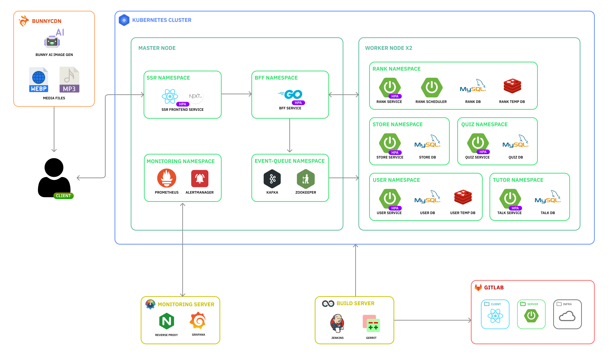

# 도란도란 (외국인을 위한 한국어 학습 애플리케이션)

팀노션 첨부 예정

## 목차

## 프로젝트 소개💼

- 프로젝트 기간 : 2024-08-19 ~ 24.10.11

## 서비스 소개

## 주요 기능

- AI 기반의 튜터와 함께 학습하며, 맞춤형 학습 가이드를 제공받을 수 있습니다. 학습 진행 상황에 따라 개인별 피드백을 실시간으로 제공합니다.

- AI가 생성한 이미지를 활용한 학습 콘텐츠를 제공합니다. 3가지 유형의 퀴즈를 통해 재미있고 효과적인 학습을 할 수 있습니다.

- 상점에서 다양한 아이템을 구매하여 캐릭터를 커스터마이징할 수 있습니다. 옷장 기능을 통해 획득한 아이템을 자유롭게 관리하고 적용할 수 있습니다.

- 학습 활동을 통해 다양한 재화를 획득하고, 경험치를 쌓아 캐릭터를 성장시킬 수 있습니다. 재화를 통해 학습의 동기부여를 높이고, 다양한 보상을 제공합니다.

- 학습 성과에 따라 사용자 간 랭킹을 확인할 수 있습니다. 자신의 랭킹을 올리기 위해 더욱 적극적인 학습을 유도합니다.

- 사용자의 학습 수준에 따라 티어가 설정됩니다. 상위 티어로 올라갈수록 더 많은 혜택과 도전 과제가 제공됩니다.

## 동작 영상
| 로그인 | 상점 |
|:---:|:---:|
|  |  |

| 마이페이지 | 랭킹 |
|:---:|:---:|
|  |  |

움짤 추가 예정

## 기술 스택

### - Backend

 
   
  
  
  
      
        
           
            

### - Frontend

   
     
  
  
   
     
        

### - Infrastructure

  
  
  
    

### - ETC

       
   
      

## 아키텍쳐 구조도

## 기대효과
- **개인 맞춤형 학습**  
    AI 기반 튜터가 학습자의 수준에 맞춘 맞춤형 학습 가이드와 실시간 피드백을 제공해 학습 효율성을 높입니다.

- **학습 동기부여**  
    재화와 경험치 시스템, 캐릭터 커스터마이징 등으로 학습자들이 더 적극적으로 학습에 참여하게 하고, 성취감을 느낄 수 있습니다.

- **경쟁을 통한 성취감 강화**  
    랭킹 시스템과 티어 제도로 학습자들이 경쟁하며 학습 성과를 높이고, 더 많은 혜택과 도전 과제를 통해 지속적인 동기부여를 얻을 수 있습니다.

## 개발 환경
### BE
- Java 17
- Spring Boot 3.3.4
- MySQL 8.0
- Redis 6.2
- Kafka
- Spring Security (User Service)
- Spring Batch (Rank Service)
- Spring Data JPA
- Spring AI

### FE
- HTML5/CSS3/JavaScript
- React 18
- Next.js 14
- Redux Toolkit
- Tailwind CSS

### Infra
- Google Cloud Platform
- BunnyCDN
- Docker
- Kubernetes
- Jenkins
- Go

### Collaboration
- GitLab
- Gerrit
- Jira

## 팀원 및 역할
<!-- 카드 형식으로 -->
<table>
    <tr>
        <td align="center"><a href="https://github.com/DaftenP">박지용</a></td>
        <td align="center"><a href="https://github.com/picel">김상범</a></td>
        <td align="center"><a href="https://github.com/hsusj996">김세진</a></td>
        <td align="center"><a href="https://github.com/dbdbais">이강우</a></td>
        <td align="center"><a href="https://github.com/everev1">김지환</a></td>
        <td align="center"><a href="https://github.com/there2989">노재훈</a></td>
        <td align="center"><a href="https://github.com/kdhn97">김동현</a></td>
    </tr>
    <tr>
        <td align="center"><a href="https://github.com/DaftenP"></a></td>
        <td align="center"><a href="https://github.com/picel"></a></td>
        <td align="center"><a href="https://github.com/hsusj996"></a></td>
        <td align="center"><a href="https://github.com/dbdbais"></a></td>
        <td align="center"><a href="https://github.com/everev1"></a></td>
        <td align="center"><a href="https://github.com/there2989"></a></td>
        <td align="center"><a href="https://github.com/kdhn97"></a></td>
    </tr>
    <tr>
        <td align="center"><b>PM, Backend</b></td>
        <td align="center"><b>Backend, Infra</b></td>
        <td align="center"><b>Backend</b></td>
        <td align="center"><b>Backend</b></td>
        <td align="center"><b>Frontend</b></td>
        <td align="center"><b>Frontend</b></td>
        <td align="center"><b>Frontend</b></td>
    </tr>
</table>